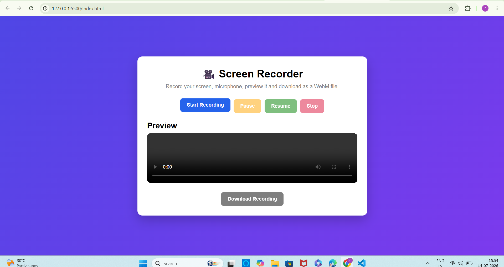
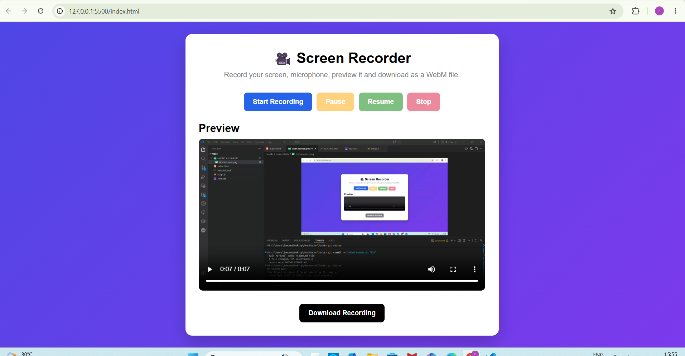
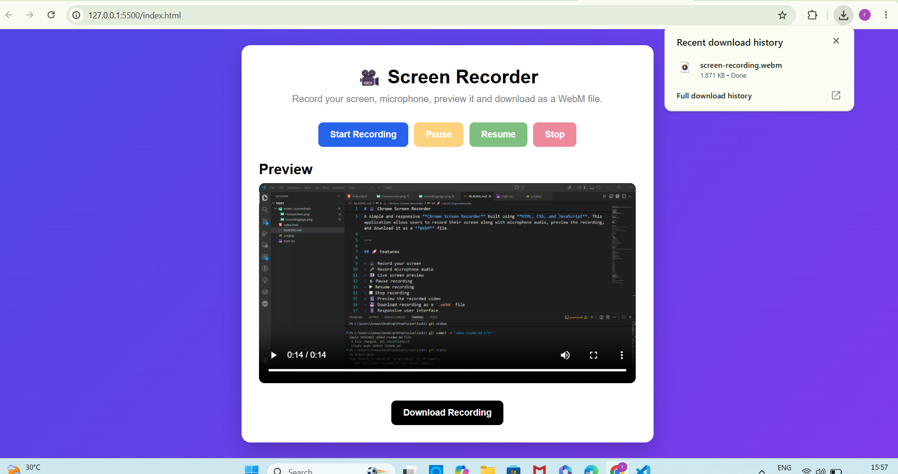

# 🎥 Chrome Screen Recorder

A simple and responsive **Chrome Screen Recorder** built using **HTML, CSS, and JavaScript**. This application allows users to record their screen along with microphone audio, preview the recording, and download it as a **WebM** file.

---

## 🚀 Features

- 🎥 Record your screen
- 🎤 Record microphone audio
- 👀 Live screen preview
- ⏸ Pause recording
- ▶ Resume recording
- ⏹ Stop recording
- 🎬 Preview the recorded video
- 💾 Download recording as a `.webm` file
- 📱 Responsive user interface
- 🔄 Automatically stops recording when screen sharing ends

---

## 🛠️ Technologies Used

- HTML5
- CSS3
- JavaScript (ES6)
- MediaRecorder API
- Screen Capture API (`getDisplayMedia`)
- MediaDevices API (`getUserMedia`)

---

## 📂 Project Structure

```

│
├── index.html
├── style.css
├── script.js
├── README.md
└── assets/
    └── screenshots/
```

---

## ⚙️ How to Run

1. Clone the repository

```bash
git clone https://github.com/XperienceInWebRakshaSoni22to26/Screen-recorder-web-app.git
```

2. Open the project folder.

3. Open `index.html` in **Google Chrome**.

**OR**

Use the **Live Server** extension in VS Code for the best experience.

---

## 📸 Screenshots

Add screenshots inside:

```
assets/screenshots/
```

Example:

```
assets/
└── screenshots/
    ├── Homescreen.png
    ├── downloadrecording.png
    └── recordingpage.png
```

Then update this section like:
## 📸 Screenshots


### 🏠 Home Screen




### 🎥 Recording Screen




### 💾 Download Recording



---

## 🎯 Browser Support

This project works best on:

- ✅ Google Chrome
- ✅ Microsoft Edge
- ✅ Brave
- ✅ Opera

> **Note:** Screen recording requires a Chromium-based browser that supports the Screen Capture API.

---

## 📖 APIs Used

### Screen Capture API

Used to capture the user's screen.

```javascript
navigator.mediaDevices.getDisplayMedia()
```

### MediaDevices API

Used to capture microphone audio.

```javascript
navigator.mediaDevices.getUserMedia()
```

### MediaRecorder API

Used to record the combined screen and audio stream.

```javascript
new MediaRecorder(stream)
```

---

## 🔄 Workflow

```
Start Recording
       │
       ▼
Capture Screen
       │
       ▼
Capture Microphone
       │
       ▼
Combine Streams
       │
       ▼
MediaRecorder
       │
       ▼
Pause / Resume
       │
       ▼
Stop Recording
       │
       ▼
Preview Video
       │
       ▼
Download WebM File
```

---

## 🚀 Future Improvements

- Record system audio
- Record webcam alongside the screen
- Recording timer
- Recording quality selection
- Dark mode
- Convert recordings to MP4
- Upload recordings directly to cloud storage

---

## 👩‍💻 Author

**Raksha Soni**

- GitHub: https://github.com/XperienceInWebRakshaSoni22to26

---

## ⭐ If you like this project

Give it a **⭐ Star** on GitHub if you found it useful!